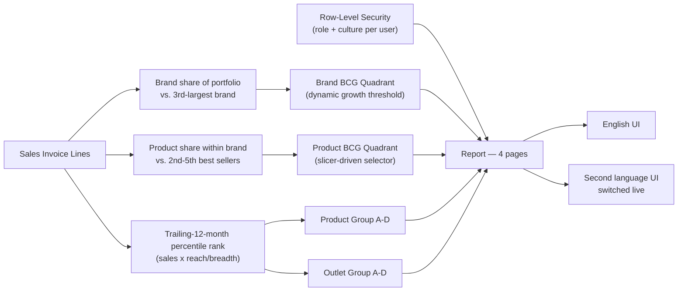

# BCG Analytics

A **Power BI** portfolio-analytics solution built for a multi-brand FMCG/consumer-
goods distribution business — a BCG growth-share matrix at brand and product grain,
plus dynamic percentile-based segmentation of products and customer outlets.

This repository documents the architecture and DAX behind this **BCG Analytics**
solution. It's a portfolio write-up, not the live report: all entity names in the
underlying model are generic sample labels (`Product 001`, `Brand 1`…), and no real
business figures, screenshots, or connection details are included here.

## Business context

A sales ranking tells you who's biggest. It doesn't tell you who's actually *winning
ground*, who's a stable cash generator worth protecting, or which long-tail products
and accounts are quietly consuming attention without earning it back. This solution
answers that with two complementary analytical models, run against the same sales
data the companion Power BI projects use — no separate data source, no manual
tiering list to maintain.

## What this covers

- **A real BCG growth-share model in DAX, not a static chart** — relative market
  share and YoY growth combine into a live quadrant classification, run at two
  genuinely different competitive grains (brand-vs-portfolio, product-vs-own-brand).
- **A growth threshold that adapts to the data** — rather than a hard-coded "10%
  growth is good," the brand model benchmarks against the *portfolio's own average
  growth rate* each period.
- **Dynamic ABCD segmentation** — both products and customer outlets are re-tiered
  automatically on every refresh from trailing-12-month percentile ranks, with
  built-in noise floors so single test transactions or one-off purchases don't
  distort the ranking.

*Out of scope for this repository:* sales monitoring, inventory, pricing/margin,
trade marketing, and sales planning are covered in separate, standalone Power BI
projects — this repo covers portfolio/segmentation analytics only.

## Architecture

## Tech stack

- **Power BI** — authored in [PBIP](https://learn.microsoft.com/power-bi/developer/projects/projects-overview) (TMDL) format for source control
- **DAX user-defined functions** — reuses 3 functions from the solution's shared time-intelligence library (see [DAX Functions Used](docs/dax-functions.md))
- **DAX measures & calculated columns** — the BCG models and ABCD segmentation logic (see [DAX Measure Catalog](docs/dax-measures.md))
- **Power Query (M)** — SQL Server import and shaping
- **Row-Level Security** — role- and culture-based, resolved from a single access-control table
- **Dynamic localization** — a live culture toggle driving every page and visual title in the report from one measure

## Documentation

| Doc | Contents |
|---|---|
| [Data Model](docs/data-model.md) | Star schema, ER diagram, table catalog, relationships, RLS, and the two-grain BCG design rationale |
| [DAX Functions Used](docs/dax-functions.md) | The 3 shared time-intelligence functions this solution calls |
| [DAX Measure Catalog](docs/dax-measures.md) | The full brand- and product-level BCG matrix logic plus both ABCD segmentation calculated columns |
| [Dynamic Titles & Localization](docs/dynamic-titles.md) | The `Security` → `Labels` → `Dynamic Labels` chain in full: the `PageKey` band scheme, every label family worked through, the exact report-visual binding, and what changes to add a language |
| [Report Tour](docs/report-pages.md) | Walkthrough of all 4 pages |

## Highlights worth a closer look

- **Two BCG models, not one formula reused.** The brand matrix benchmarks against
  the 3rd-largest brand in the *whole portfolio*; the product matrix deliberately
  excludes the #1 seller and benchmarks each product against the *average of the
  2nd-5th best sellers in its own brand* — because a product's real competition is
  the rest of its brand's lineup, not the entire catalog.
- **A self-adjusting growth threshold.** `Brand Growth Threshold (Average)` is
  computed live from every brand's own YoY growth — the Star/Cash Cow line moves
  with the portfolio's actual performance instead of a number someone picked once.
- **Self-maintaining segmentation with built-in noise floors.** Both `Product Group`
  and `Outlet Group` recompute every refresh from percentile rank, and their
  supporting sales/reach measures floor out negligible values (a handful of units,
  a single outlet) before they're allowed to distort a tier boundary.
- **Titles bind to measures, never hardcoded text.** Every page title is a hidden
  action-button visual with its title/subtitle bound via `fx` straight to a
  `'Page N | Title'` measure — a text box can't take a measure binding, so this is
  what keeps a title from silently going stale the moment someone edits the page. A
  missing translation surfaces as a visible `⚠` instead of quietly falling back to
  English. Full write-up: [Dynamic Titles & Localization](docs/dynamic-titles.md).

## License

[MIT](LICENSE) — this repository (documentation, DAX/architecture write-ups) may be
reused freely with attribution. It does not include the underlying `.pbix`/PBIP
project files, which remain private.

## Author

**Fuad Gashi** — Power BI / Business Intelligence developer.
[GitHub](https://github.com/fuadgashi)
