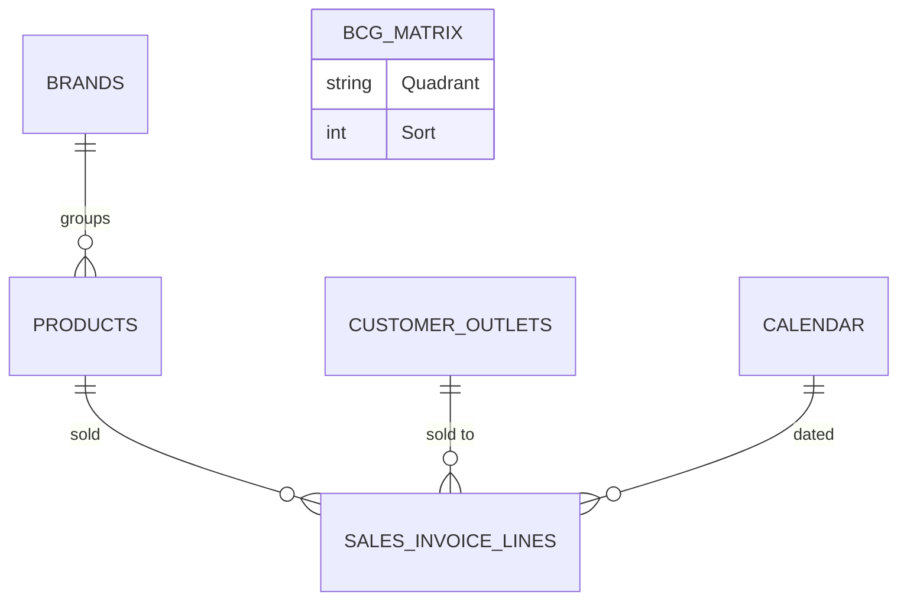

# Data Model

This solution answers a portfolio-strategy question that a plain sales ranking
can't: *which brands and products are genuinely winning market position, which are
just riding overall growth, and which customers/products should be treated as core
vs. long-tail?* It layers a BCG growth-share model and a dynamic percentile
segmentation on top of the same sales fact used in the companion Power BI projects.

> **Scope note.** This repository covers **Analytical Models** only — the BCG
> growth-share matrix (brand and product level) and dynamic ABCD segmentation
> (product and customer-outlet level).

## Entity-relationship diagram

## Table catalog

### Dimensions

| Table | Purpose |
|---|---|
| **Calendar** | Date dimension backing the year-to-date / prior-year / trailing-12-month windows every growth calculation depends on. |
| **Products** | Product master. Carries a **dynamic percentile-segmentation calculated column** (`Product Group`) that re-buckets every active product into a tier by trailing-12-month sales *and* store distribution — recomputed automatically on refresh, never manually maintained. |
| **Brands** | Brand master (10 brands across 4 divisions) — the grain the brand-level BCG matrix classifies. |
| **Customer Outlets** | Individual outlet/branch. Carries the equivalent segmentation column (`Outlet Group`) by trailing-12-month sales and assortment breadth (distinct products purchased). |

### Facts

| Table | Purpose |
|---|---|
| **Sales Invoice Lines** | The sales fact table (shared with the Sales Analytics solution) — every growth, share, and segmentation calculation in this solution reduces back to this table. Referenced here as an input only; see the [Sales Analytics](https://github.com/fuadgashi/Sales-Analytics) repository for its full measure catalog. |

### Analytical table (no data rows — pure DAX)

| Table | Purpose |
|---|---|
| **BCG Growth-Share Matrix** | A 4-row calculated table (`Star` / `Cash Cow` / `Question Mark` / `Dog`, each with a sort order) plus measures that classify every brand and product into a quadrant from relative market share and YoY growth. Deliberately disconnected from the relationship graph — it hosts measures and a scatter-chart quadrant lookup, not filterable transactional data. |

### Infrastructure (security & localization)

| Table | Purpose |
|---|---|
| **Security** | Row-level-security table — one row per viewer, mapping a UPN to a **role** and a **culture**. Disconnected from the relationship graph; read only through `[User Culture]`. |
| **Labels** | Plain data table — one row per page/visual, per culture, per label role. The source of every piece of user-facing text in the report. Disconnected from the relationship graph. |
| **Dynamic Labels** | Measure-only table hosting one text measure per label, each a lookup against `Labels`. Full reference: [Dynamic Titles & Localization](dynamic-titles.md). |

## Relationships

| From | To |
|---|---|
| Products[BrandId] | Brands[Id] |
| Sales Invoice Lines[ProductId] | Products[Id] |
| Sales Invoice Lines[OutletId] | Customer Outlets[Id] |
| Sales Invoice Lines[Date] | Calendar[Date] |

## Row-level security & dynamic localization

Three tables work together to drive a genuinely dynamic, bilingual UI — not two
duplicated sets of pages: `Security` resolves *who* is looking and which culture
they should see (`User Culture = SELECTEDVALUE(Security[Culture], "en-US")`);
`Labels` holds *what* every label says, in every supported culture, keyed by a
`PageKey` band scheme; `Dynamic Labels` holds *the lookup* — one measure per label,
bound into the report through hidden action-button visuals rather than text boxes.

The report ships with **English as the default culture** and **Albanian as a fully
supported secondary culture**. Assign a viewer's row a different `Culture` value and
every page and visual title relabels instantly; adding a third language means adding
rows to `Labels`, not touching a single measure or rebuilding the report.

Full reference — the key scheme, every label family worked through, the exact `fx`
binding, and what changes to add a language: [Dynamic Titles & Localization](dynamic-titles.md).

## Design note: two BCG models at two different grains

The matrix runs **twice**, at two genuinely different competitive grains, not the
same formula reused at a different level:

- **Brand-level** compares each brand's market share against the *3rd-largest brand
  in the whole portfolio* — the classic BCG "market leader" framing.
- **Product-level** compares each product's share against the *average of the 2nd
  through 5th best-selling products within its own brand* — because a product's real
  competitive set is the other SKUs in its own brand's lineup, not the entire
  catalog.

Both feed the same quadrant logic (share threshold × growth threshold → Star / Cash
Cow / Question Mark / Dog), but the brand model uses a **fixed 10% share threshold**
and a **dynamically averaged growth threshold** (see
[DAX Measure Catalog](dax-measures.md#brand-level-bcg-matrix)), while the product
model exposes its quadrant through a slicer-driven selector rather than a text label
— two different visual patterns for two different audiences (a strategy view vs. an
interactive matrix chart).
